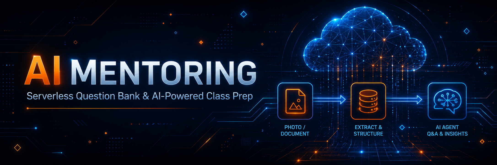
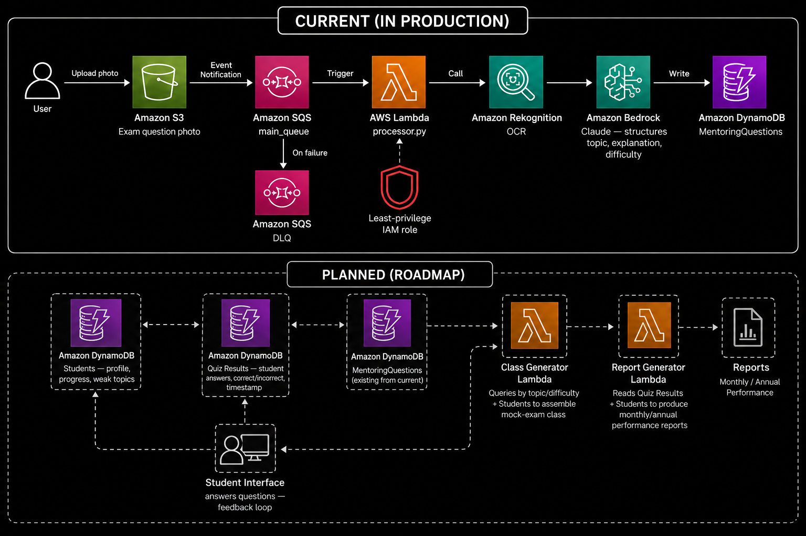

# AI Mentoring



Serverless, event-driven platform that turns exam-question photos into a structured question bank, built to support AWS certification mentoring sessions at Escola da Nuvem.

This project is already in real use in my mentoring sessions and is being actively developed toward a fully operational platform — with the long-term goal of exploring monetization once the student-facing features are in place.

---

## 🏗️ Solution Architecture 



--- 

## What it does today

Mentoring students send photos of exam-style questions (from mock exams they're studying). The pipeline automatically extracts the question, classifies it by topic and difficulty, and stores it in a structured database — building a growing question bank that feeds future "commented mock exam" classes.

## Architecture

```
S3 (exam question photo)
   → S3 Event Notification
   → SQS (main queue, with DLQ)
   → Lambda (processor.py)
        → Amazon Rekognition (OCR)
        → Amazon Bedrock — Claude (structures topic, explanation, difficulty)
   → DynamoDB (MentoringQuestions)
```

- **Amazon S3** — receives the exam question photo upload.
- **Amazon SQS** — decouples ingestion from processing; includes a Dead Letter Queue (`maxReceiveCount=4`) so a failed message doesn't get lost or block the queue.
- **AWS Lambda** — runs OCR via Rekognition, then prompts Amazon Bedrock (Claude) to return structured JSON (`topic`, `explanation`, `difficulty`), and writes the result to DynamoDB.
- **Amazon DynamoDB** (`MentoringQuestions`) — `QuestionID` as partition key, with a GSI on `Topic` for querying the question bank by subject.
- **Amazon DynamoDB** (`Quizzes`, `QuizResults`) — stores quiz sessions and student answers.
- **Amazon DynamoDB** (`Students`) — stores student profiles with GSI on `Email`.
- **AWS Lambda** (`quiz_engine.py`) — generates quizzes from the question bank and records student responses.
- **AWS Lambda** (`student_api.py`) — CRUD operations for student profiles with Cognito token validation.
- **Amazon Cognito** — user authentication with email/password, JWT tokens for API access.
- **IAM** — a dedicated role and policy scoped to only the resources this Lambda needs.
- **Terraform** — the entire infrastructure above is defined as code.

## Tech stack

AWS Lambda · Amazon SQS · Amazon DynamoDB · Amazon Rekognition · Amazon Bedrock · Amazon S3 · Amazon Cognito · IAM · Terraform · Python (Boto3)

## Project structure

```
.
├── main.tf, iam.tf, dynamodb.tf, lambda.tf, provider.tf   # Infrastructure as Code
├── lambda_quiz_engine.tf, iam_quiz_engine.tf               # Quiz engine Lambda + IAM
├── lambda_student_api.tf, iam_student_api.tf               # Student API Lambda + IAM
├── cognito.tf, outputs.tf                                  # Cognito User Pool + App Client
├── requirements.txt        # Python dependencies packaged with the Lambda
├── src/
│   ├── processor.py        # Lambda: OCR + Bedrock + DynamoDB
│   ├── quiz_engine.py      # Lambda: generación de quizzes y registro de respuestas
│   └── student_api.py      # Lambda: CRUD de alumnos con validación Cognito
├── events/                 # Test events for Lambda invocations
├── docs/
│   ├── status.md           # Engineering log: findings, technical debt, roadmap
│   └── quiz-results-dashboard.html  # Quiz results visualization
└── README.md
```

Infrastructure code lives at the project root; application code lives under `src/` — this keeps the Lambda deployment package (zipped by Terraform's `archive_file`) limited to only the code that actually runs, without pulling in Terraform files or documentation.

## Roadmap

The pipeline above covers question ingestion and classification — one piece of a larger platform. Next up:

- [x] Student profiles and progress tracking
- [x] Quiz results storage (linking students to questions answered, correct/incorrect, timestamps)
- [ ] "Class generation" logic: pull questions by topic/difficulty, prioritizing a student's weak areas
- [ ] Automated report generation (monthly/annual metrics per student and per class)
- [ ] A way for students to actually answer generated questions (today the flow is one-directional: photo in, classification out)

Full engineering notes and technical debt tracking live in [`docs/status.md`](docs/status.md).

## Deploying

```bash
terraform init
terraform plan
terraform apply
```

Requires Terraform >= 1.5.0, Python 3.12, and AWS CLI configured with active credentials.

## Author

**Daniel Villegas**
Cloud Engineer | AWS Certified (4x)
[LinkedIn](https://www.linkedin.com/in/vdaniel07) · [GitHub](https://github.com/DevDan7)
