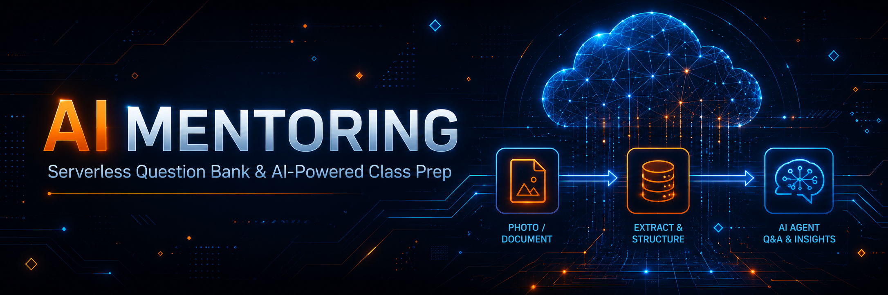
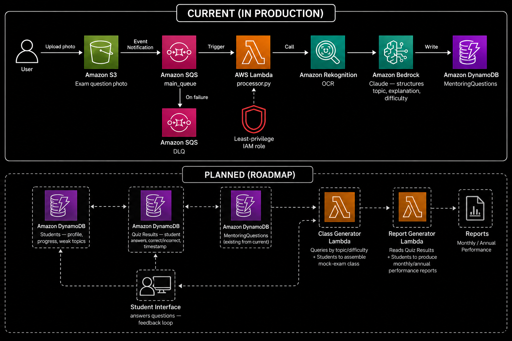

# AI Mentoring



Serverless, event-driven platform that turns exam-question photos into a structured question bank, built to support AWS certification mentoring sessions at Escola da Nuvem.

This project is already in real use in my mentoring sessions and is being actively developed toward a fully operational platform — with the long-term goal of exploring monetization once the student-facing features are in place.

---

## 🏗️ Solution Architecture 



Editable source: [`doc/architecture.drawio`](doc/architecture.drawio) (open it with [draw.io](https://app.diagrams.net)).

--- 

## What it does today

The platform has two separate sides:

**1. Question bank ingestion (mentor only).** The mentor is the only person who loads the question bank — students never upload anything. The process:

1. The mentor takes photos of exam-style questions (from mock exams) and uploads them to an S3 bucket.
2. S3 notifies an SNS topic, which fans out to an SQS queue (processing) and to the mentor's email.
3. A Lambda reads each photo and sends it to Amazon Bedrock (Claude, multimodal), which extracts the question and options and returns structured JSON, classified into one of 10 canonical topics.
4. The Lambda skips content that already exists (hash-based dedupe) and stores the question in DynamoDB.
5. If a photo can't be processed, the mentor gets an email alert; messages that keep failing land in a dead-letter queue.

The result is a growing, deduplicated question bank that feeds the student quizzes and the "commented mock exam" classes.

**2. Student learning platform.** Students sign in and practice with questions from that bank, following a simplified learning model: a diagnostic quiz (`initial`), free practice by topic (`free_practice`), and a teacher-released 65-question final exam (`final_exam`). The teacher dashboard manages students, cohorts, phase changes and final-exam release/reset. Students join a cohort through an enrollment link (`?turma=<cohort_id>`).

## Architecture

```
[Student / Teacher Browser]
    → AWS Amplify (HTTPS hosting, auto-deploy from GitHub)
    → Cognito (login → JWT)
    → API Gateway HTTP API (JWT Authorizer)
        → Lambda (student_api.py) → DynamoDB (Students, Cohorts)
        → Lambda (quiz_engine.py) → DynamoDB (Quizzes, QuizResults, Students, MentoringQuestions read-only)

[Question Bank Ingestion — mentor only]
S3 (exam question photo)
   → S3 Event Notification → SNS topic ──→ email to the mentor
                                       └──→ SQS (main queue, with DLQ)
   → Lambda (processor.py)
        → Amazon Bedrock — Claude Haiku 4.5 (multimodal: reads the image, structures topic, options, explanations)
        → SNS alert if the image can't be processed
   → DynamoDB (MentoringQuestions, dedupe via ContentHashIndex)

[CI/CD]
GitHub → GitHub Actions (OIDC role) → terraform plan on PRs, terraform apply on push to main
```

- **Amazon S3** — receives the exam question photos uploaded by the mentor.
- **Amazon SNS** — S3 notification topic: fans out to SQS and to the mentor's email; the processor Lambda also publishes alerts here for unprocessable images.
- **AWS Amplify** — HTTPS hosting for the frontend (`index`, `dashboard`, `quiz`, `results`, `teacher`) with auto-deploy on each push to `main`.
- **Amazon API Gateway** (HTTP API) — entry point for all student-facing API calls; JWT Authorizer validates Cognito tokens before reaching Lambda.
- **Amazon SQS** — decouples ingestion from processing; includes a Dead Letter Queue (`maxReceiveCount=4`) so a failed message doesn't get lost or block the queue.
- **AWS Lambda** (`processor.py`) — reads the exam photo from S3 and sends the image directly to Amazon Bedrock (Claude, multimodal) for OCR + structured JSON (`topic` from 10 canonical categories, options with explanations), then writes to DynamoDB unless the content already exists (Rekognition was removed on 2026-09-02).
- **AWS Lambda** (`student_api.py`) — auth with JWT claims + `cognito:groups`, CRUD for student profiles, cohorts, config and final-exam management.
- **AWS Lambda** (`quiz_engine.py`) — generates quizzes (diagnostic, free by topic, final exam), records responses, resumes `in_progress` sessions, computes results with `domain_breakdown`.
- **Amazon DynamoDB** (`MentoringQuestions`) — `QuestionID` as partition key, with GSIs on `Topic` (query by subject) and `ContentHash` (content dedupe).
- **Amazon DynamoDB** (`Quizzes`, `QuizResults`) — stores quiz sessions and student answers.
- **Amazon DynamoDB** (`Students`) — stores profiles (phase `initial`/`free_practice`/`final_exam`) with GSIs on `Email` and `CohortID`.
- **Amazon DynamoDB** (`Cohorts`) — cohorts (turmas) with capacity limit (`MaxStudents`); students enroll through the `?turma=<id>` link.
- **Amazon Cognito** — User Pool + App Client for student authentication; email/password login, JWT tokens for API access.
- **IAM** — dedicated roles and policies scoped to only the resources each Lambda needs.
- **Terraform** — the entire infrastructure above is defined as code, with remote state in S3.
- **GitHub Actions** — CI/CD authenticated via OIDC with a dedicated IAM role: `terraform plan` on every PR, `terraform apply` on merge to `main`.

## Tech stack

AWS Lambda · Amazon API Gateway · Amazon SQS · Amazon SNS · Amazon DynamoDB · Amazon Bedrock · Amazon S3 · AWS Amplify · Amazon Cognito · IAM · Terraform · GitHub Actions · Python (Boto3) · HTML · CSS (Pico.css) · JavaScript · Hypothesis (property-based tests)

## Project structure

```
.
├── main.tf, iam.tf, dynamodb.tf, lambda.tf, provider.tf   # Infrastructure as Code (S3, SNS, SQS, IAM, DynamoDB, Lambda)
├── api_gateway.tf, api_gateway_authorizer.tf, api_gateway_routes.tf  # API Gateway HTTP API
├── lambda_quiz_engine.tf, iam_student_api.tf               # Quiz engine Lambda + IAM
├── lambda_student_api.tf, iam_student_api.tf               # Student API Lambda + IAM
├── cognito.tf, outputs.tf                                  # Cognito User Pool + App Client
├── amplify.tf                                              # Amplify Hosting for the frontend
├── .github/workflows/      # CI/CD: terraform-plan.yml (PRs), terraform-apply.yml (main)
├── tests/                  # pytest + Hypothesis (property-based) tests
├── requirements.txt        # Python dependencies packaged with the Lambda
├── src/
│   ├── processor.py        # Lambda: Bedrock multimodal (OCR + JSON) + DynamoDB
│   ├── quiz_engine.py      # Lambda: quizzes, respuestas, examen final (65q)
│   ├── student_api.py      # Lambda: CRUD alumno/cohorte + final-exam release/reset
│   └── frontend/           # Frontend (HTML/CSS/JS, deployed via Amplify)
│       ├── index.html      # Login / Registro
│       ├── dashboard.html  # Perfil del alumno + generar quiz
│       ├── quiz.html       # Tomar quiz
│       ├── results.html    # Ver resultados
│       ├── teacher.html    # Panel del profesor (alumnos, cohortes, fases, examen)
│       └── js/             # Módulos JS (config, auth, api, teacher)
├── events/                 # Test events for Lambda invocations
│   └── apigw/              # Test events en formato API Gateway v2.0
├── scripts/
│   ├── test_api.sh         # Script de testing end-to-end
│   ├── migrate_clean.py    # Migración: limpieza de tablas + seed turma-beta-01 (manual)
│   └── migrate_restore.py  # Migración: restauración desde backups (manual)
├── doc/
│   ├── DOCUMENTATION.md    # Índice de documentación del proyecto
│   ├── architecture.md     # Arquitectura, modelo de datos, decisiones
│   ├── technical-log.md    # Pruebas, problemas, soluciones
│   ├── changelog.md        # Registro de cambios consolidado
│   ├── roadmap.html        # Roadmap interactivo del proyecto
│   └── questions/          # Banco de preguntas (PNG)
└── README.md
```

Infrastructure code lives at the project root; application code lives under `src/` — this keeps the Lambda deployment package (zipped by Terraform's `archive_file`) limited to only the code that actually runs, without pulling in Terraform files or documentation.

## Roadmap

The pipeline above covers question ingestion and classification — one piece of a larger platform. Status:

- [x] Student profiles and progress tracking (simplified phase model: `initial` → `free_practice` → `final_exam`)
- [x] Quiz results storage (linking students to questions answered, correct/incorrect, timestamps) with `domain_breakdown`
- [x] A way for students to answer quizzes (Amplify-hosted frontend: index, dashboard, quiz, results)
- [x] Teacher dashboard (students, cohorts, phase changes, final-exam release/reset)
- [x] Final exam (65 questions, CLF-C02 matrix, release-by-date, 1 attempt, anti-repetition, resume `in_progress`)
- [x] Beta cohort seeded (`turma-beta-01`) and data migration for production cleanup (2026-09-07)
- [x] In production with real cohorts, CI/CD via GitHub Actions (OIDC) and security audits of the API (answers are no longer exposed to students)
- [ ] Automated report generation (monthly/annual metrics per student and per class)
- [ ] CloudFront legacy cleanup (replaced by Amplify)

Full engineering notes and technical debt tracking live in [`doc/DOCUMENTATION.md`](doc/DOCUMENTATION.md).

## Documentation

Internal documentation lives in `doc/`, organized by theme:

| File | Purpose |
|------|---------|
| [`DOCUMENTATION.md`](doc/DOCUMENTATION.md) | Documentation index and maintenance instructions |
| [`architecture.md`](doc/architecture.md) | System architecture, data model, design decisions |
| [`technical-log.md`](doc/technical-log.md) | Performance tests, problems, solutions |
| [`changelog.md`](doc/changelog.md) | Consolidated chronological change log |
| [`roadmap.html`](doc/roadmap.html) | Interactive project roadmap |

Each file is self-contained. Start with `DOCUMENTATION.md` for an overview of the project's technical state.

## Deploying

Deployment is automated through GitHub Actions:

- **Pull request → `main`**: `terraform plan` runs and shows the proposed changes.
- **Merge to `main`**: `terraform apply` runs in the `production` environment, and AWS Amplify redeploys the frontend.

To preview changes locally (never apply from a laptop):

```bash
terraform init
terraform plan
```

Data migration scripts (manual, never via CI/CD) live in `scripts/`:

```bash
python scripts/migrate_clean.py --dry-run   # verify, no mutation
python scripts/migrate_clean.py             # export → confirm "SI" → clean → seed turma-beta-01
python scripts/migrate_restore.py           # restore from latest backup set in scripts/backup/
```

Requires Terraform >= 1.5.0, Python 3.12, AWS CLI configured with active credentials, and a deployed Cognito User Pool.

## Author

**Daniel Villegas**
Cloud Engineer | AWS Certified (4x)
[LinkedIn](https://www.linkedin.com/in/vdaniel07) · [GitHub](https://github.com/DevDan7)
